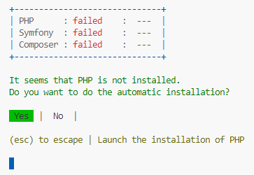
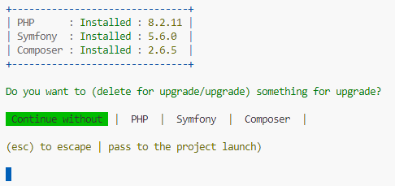
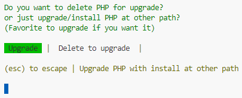

# Welcom to the StudentGram setup

* **Start & config database host :**
  You can configurate your database host in `.env` file
  inside the `doctrine/doctrine-bundle` block.
  This file have default configuration for the next host :

  ```
  DATABASE_URL="mysql://root:@127.0.0.1/studentgram?serverVersion=10.11.2-MariaDB&charset=utf8mb4"
  ```

---

* **Installation of requirements, createdatabase,
  synchronise symfony doctrines & launch server :**
  Use the `./setup` command in a terminal at the root of the project.
  Project require PHP, Symfony & Composer to be run.
  All installations or upgrades made from this program are effected in `appdata/roaming` folder.

  ---


  * **Installation of requirements**
    If you don't have, the program will propose you to install missing requirements.

  ---

  * **Upgrade of requirements**
    The program will ask you if you want to upgrade any requirements if you want.
    After you have to choose type of upgrade, delete actual version to upgrade or just upgrade.
    (we recommand to just upgrade)
    ------------------------------
  * **Creation of database**
